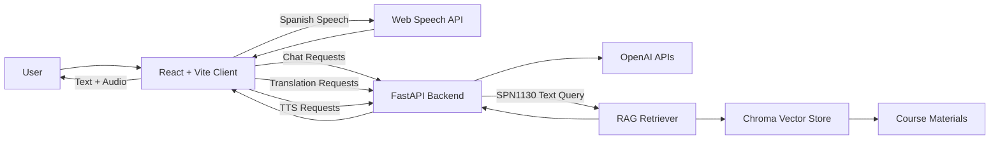

# 🐊 Gator Gabber

**AI-powered Spanish conversation practice with speech tools and course-aware retrieval.**

Gator Gabber is an interactive Spanish-learning platform designed to help students practice conversation, pronunciation, and comprehension through an AI tutor.

The application combines a **React frontend**, **FastAPI backend**, speech-to-text and text-to-speech tools, and **retrieval-augmented generation (RAG)** for course-specific learning material.

[](https://gatorgabber.vercel.app)

> **Deployment note:** The first AI response may take longer if the backend has been inactive and needs to cold-start.

---

## Features

### Implemented

- **AI Spanish Conversation**
  - Chat with an AI Spanish tutor through a conversational interface.
  - Responses can adapt based on the selected course context.

- **Speech-to-Text**
  - Speak Spanish directly into the application.
  - Uses the browser's Web Speech API to convert speech into text.

- **Text-to-Speech**
  - Listen to AI-generated Spanish responses.
  - Supports normal and slowed playback speeds for pronunciation practice.

- **Translation**
  - Translate Spanish responses into English when additional clarification is needed.

- **Syllabification**
  - Break Spanish words into syllables to assist with pronunciation.

- **Course Context Selection**
  - Select between:
    - General
    - SPN1130
    - SPN1131
    - SPN2200
    - SPN2201

- **SPN1130 Retrieval-Augmented Generation**
  - SPN1130 text conversations can retrieve relevant course material from a vector database.
  - Retrieved information is added to the LLM context before a response is generated.

- **File Attachments**
  - Attach supported images or text files to a conversation.
  - Images can be processed by a vision-capable model.
  - Text documents can be incorporated into the conversation context.

- **Custom Tutor Prompts**
  - Configure a custom system prompt.
  - Configure a custom initial tutor message.
  - Preferences are stored locally in the browser.

- **Responsive Interface**
  - Designed for both desktop and mobile use.

---

## Planned / Incomplete Features

The following features are part of the broader direction of the project but are **not fully implemented**:

- RAG support for SPN1131
- RAG support for SPN2200
- RAG support for SPN2201
- Larger collections of indexed course material
- Additional languages beyond Spanish
- More advanced pronunciation feedback
- Improved deployment monitoring and production reliability
- Expanded instructor customization tools

Currently, the retrieval pipeline is specifically implemented for **SPN1130 text conversations**.

---

## Architecture



### Request Flow

For a standard conversation:

```text
User
  ↓
React Client
  ↓
FastAPI API
  ↓
OpenAI
  ↓
FastAPI
  ↓
React Client
```

For an SPN1130 RAG conversation:

```text
User Question
      ↓
React Client
      ↓
FastAPI
      ↓
RAG Retriever
      ↓
Chroma Vector Store
      ↓
Relevant Course Content
      ↓
LLM Prompt
      ↓
OpenAI
      ↓
Response
```

---

## Tech Stack

### Frontend

- React
- Vite
- JavaScript
- CSS
- React Icons
- Web Speech API

### Backend

- Python
- FastAPI
- Uvicorn
- Pydantic

### AI

- OpenAI language models
- OpenAI Vision
- OpenAI Text-to-Speech

### Retrieval-Augmented Generation

- LangChain
- ChromaDB
- PyPDF
- OpenAI embeddings
- Course-specific vector stores

---

## Project Structure

```text
Gator_Gabber/
│
├── client/
│   ├── src/
│   │   ├── assets/
│   │   ├── components/
│   │   ├── services/
│   │   │   └── api.js
│   │   ├── utils/
│   │   ├── App.jsx
│   │   ├── stt.js
│   │   └── tts.js
│   │
│   ├── public/
│   └── package.json
│
├── GatorGabbeler/
│   └── server/
│       ├── app/
│       │   ├── config/
│       │   │   └── system_prompt.py
│       │   │
│       │   ├── services/
│       │   │   ├── providers/
│       │   │   └── llm.py
│       │   │
│       │   ├── rag/
│       │   │   ├── retriever.py
│       │   │   └── vector_store.py
│       │   │
│       │   └── main.py
│       │
│       ├── data/
│       │   └── spanish_1130/
│       │       └── chroma_db/
│       │
│       └── requirements.txt
│
└── README.md
```

---

## Getting Started

### Prerequisites

You will need:

- Node.js
- npm
- Python 3.11 or 3.12
- An OpenAI API key

Python 3.11 or 3.12 is recommended because some of the RAG dependencies may not provide compatible pre-built wheels for newer Python versions.

---

## Backend Setup

Navigate to the backend:

```bash
cd GatorGabbeler/server
```

Create a virtual environment:

```bash
python -m venv .venv
```

Activate it.

### Windows

```bash
.venv\Scripts\activate
```

### macOS / Linux

```bash
source .venv/bin/activate
```

Install dependencies:

```bash
pip install -r requirements.txt
```

Create a `.env` file inside the server directory:

```env
OPENAI_API_KEY=your_openai_api_key
```

Start the FastAPI server:

```bash
uvicorn app.main:app --reload --port 5050
```

The backend should now be available at:

```text
http://localhost:5050
```

FastAPI's automatically generated API documentation can be accessed at:

```text
http://localhost:5050/docs
```

---

## Frontend Setup

Open another terminal and navigate to the frontend:

```bash
cd client
```

Install dependencies:

```bash
npm install
```

Create a `.env` file:

```env
VITE_API_URL=http://localhost:5050
```

Start the Vite development server:

```bash
npm run dev
```

Vite will display the local frontend address in the terminal.

---

## API

The FastAPI backend exposes several endpoints used by the React application.

### Chat

```http
POST /api/chat
```

Handles:

- text conversations
- course context
- image attachments
- text-file attachments
- custom tutor prompts
- SPN1130 RAG

Example request:

```json
{
  "text": "¿Cuál es la diferencia entre ser y estar?",
  "classContext": "spanish_1130",
  "file": null,
  "fileMetadata": null,
  "customSystemPrompt": null,
  "customInitialMessage": null
}
```

---

### Translation

```http
POST /api/translate
```

Example:

```json
{
  "text": "¿Cómo estás?",
  "target_language": "English"
}
```

---

### Text-to-Speech

```http
POST /api/tts
```

Example:

```json
{
  "text": "Hola, ¿cómo estás?",
  "speed": 1.0
}
```

The API returns an MP3 audio stream.

---

### RAG Status

```http
GET /api/rag/status
```

Provides information about the SPN1130 retrieval system, including whether:

- the vector store exists
- course documents are available
- similarity search is functioning

---

## Retrieval-Augmented Generation

Gator Gabber uses RAG to provide course-aware responses.

For SPN1130 text conversations, the system:

1. Receives the student's question.
2. Searches the SPN1130 vector store.
3. Retrieves the most relevant pieces of course material.
4. Adds those materials to the model context.
5. Sends the augmented prompt to the LLM.
6. Generates a Spanish response grounded in the retrieved material.

Conceptually:

```text
Question
   ↓
Embedding / Similarity Search
   ↓
ChromaDB
   ↓
Relevant Course Chunks
   ↓
Augmented Prompt
   ↓
LLM
   ↓
Course-Aware Response
```

If retrieval fails or no useful context is available, the application can continue with a normal LLM conversation.

### Current limitation

RAG currently activates only for:

```text
spanish_1130
```

SPN1131, SPN2200, and SPN2201 can use different conversational contexts, but they do not currently have their own retrieval pipelines.

---

## Speech Tools

### Speech-to-Text

Speech recognition is handled through the browser's Web Speech API.

```text
Microphone
    ↓
Web Speech API
    ↓
Spanish Transcript
    ↓
Chat Input
```

Browser support varies. If the Web Speech API is unavailable, the rest of the application can still be used through text input.

### Text-to-Speech

AI responses are sent to the backend's TTS endpoint:

```text
AI Response
    ↓
FastAPI
    ↓
OpenAI TTS
    ↓
MP3 Audio
    ↓
Browser Playback
```

Users can replay responses at normal or reduced speed.

---

## File Attachments

The chat interface supports additional conversational context through file uploads.

### Images

Supported images can be encoded and sent to the backend, where they are processed using a vision-capable model.

### Text Files

Text files are decoded by the backend and incorporated directly into the prompt context.

The frontend currently limits uploads to supported image and text formats and applies a file-size limit before sending them to the API.

---

## Deployment

The frontend is deployed using Vercel:

**Live application:**  
https://gatorgabber.vercel.app

The React frontend communicates with the deployed FastAPI backend through the URL configured in:

```env
VITE_API_URL
```

The backend CORS configuration must include the frontend's production origin.

---

## Troubleshooting

### Backend will not start

Confirm that:

- Python 3.11 or 3.12 is being used.
- The virtual environment is activated.
- All dependencies have been installed.

```bash
pip install -r requirements.txt
```

---

### OpenAI requests fail

Verify that:

```env
OPENAI_API_KEY=your_key_here
```

exists in the backend environment.

Do not commit `.env` files or API keys to Git.

---

### Frontend cannot reach the API

Verify:

```env
VITE_API_URL=http://localhost:5050
```

for local development.

Also confirm that the FastAPI server is running:

```bash
uvicorn app.main:app --reload --port 5050
```

---

### Speech recognition does not work

Speech-to-text depends on browser support for the Web Speech API.

Try using a Chromium-based browser if speech recognition is unavailable.

---

### RAG does not return course content

Check:

```http
GET /api/rag/status
```

and verify that the SPN1130 vector store has been created and contains indexed course material.

---

## Motivation

Language learning improves through active practice, but students do not always have someone available to practice conversation with.

Gator Gabber explores how modern AI systems can provide students with an accessible conversational partner while also incorporating tools such as:

- speech recognition
- pronunciation support
- translation
- course-specific context
- retrieval-augmented generation

The goal is not simply to create a generic chatbot, but to investigate how AI can provide a more useful **course-aware language-learning experience**.

---

## Future Work

Potential directions include:

- course-specific RAG databases for additional UF Spanish courses
- instructor-managed course material
- pronunciation scoring
- vocabulary tracking
- conversation difficulty adaptation
- learning-progress analytics
- additional languages
- improved retrieval evaluation
- stronger grounding and citation of retrieved material
- persistent student learning profiles

---

## License

No open-source license is currently specified.

If the project is intended to be reusable by others, an MIT License would be a straightforward option.

---

## Authors

Built by University of Florida students as an exploration of AI-assisted language learning.
